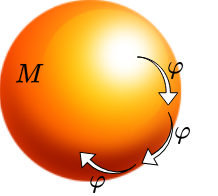
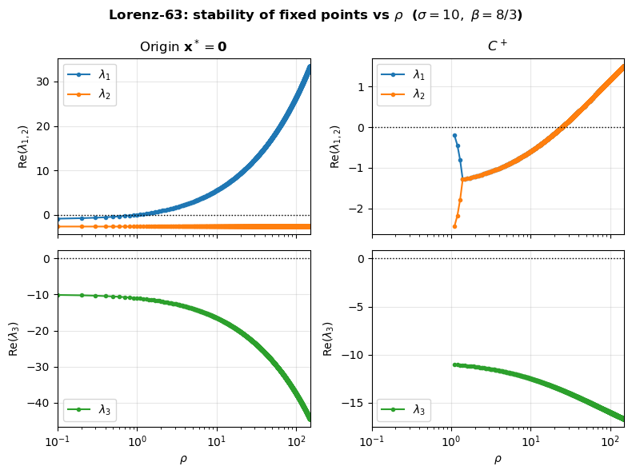
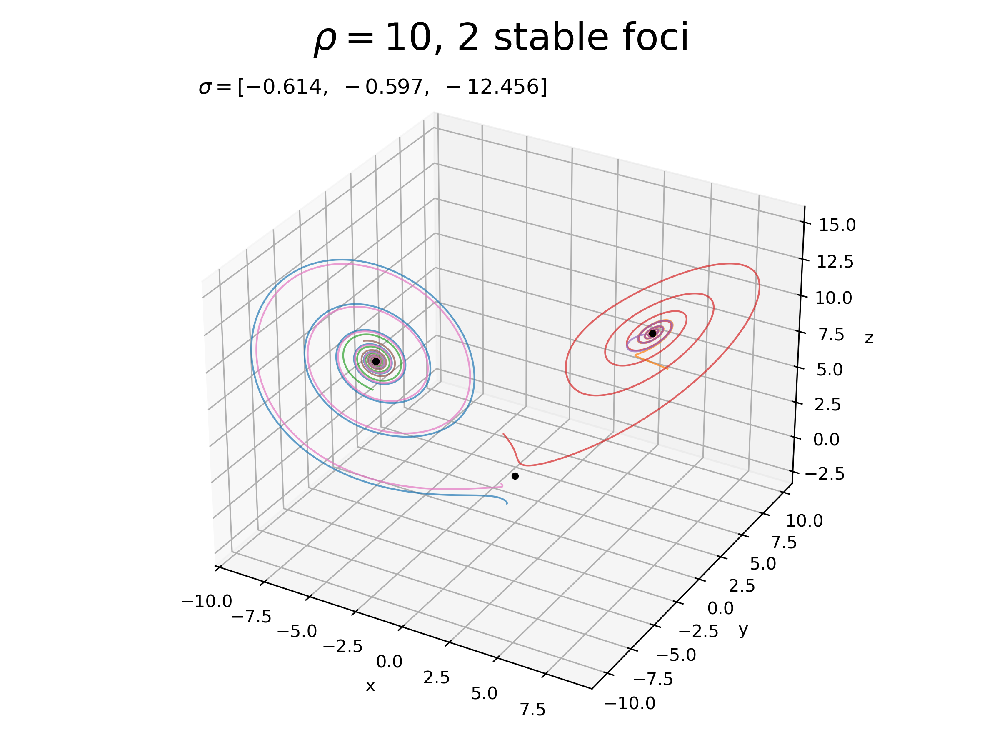
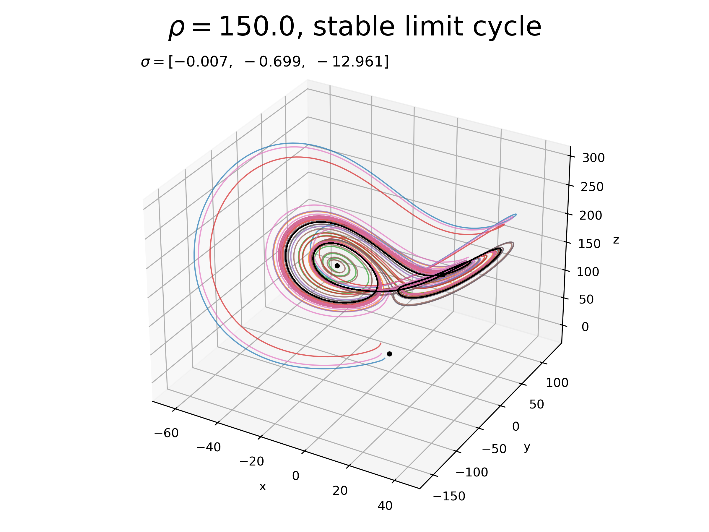
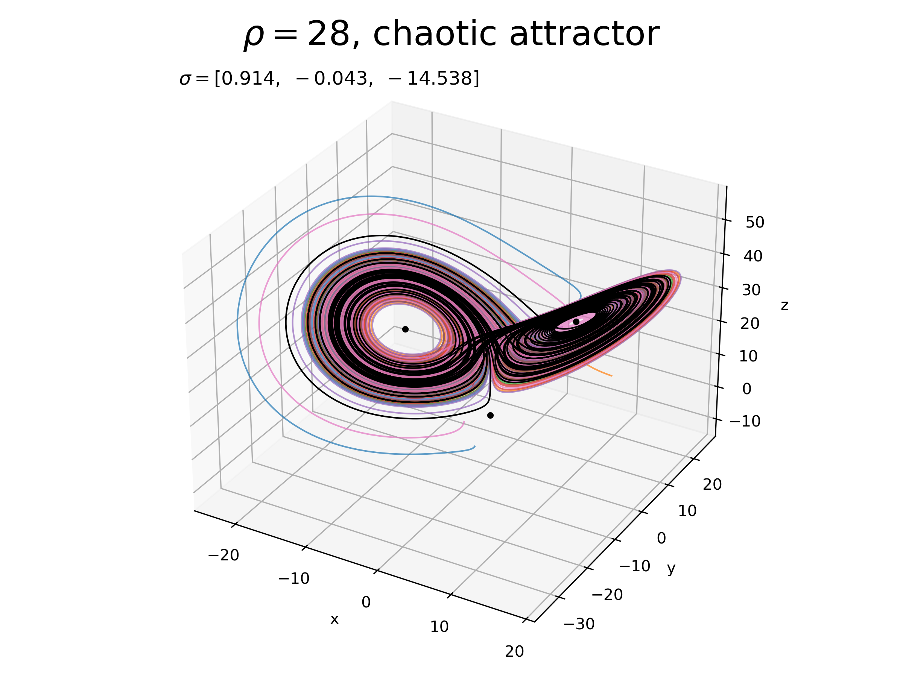
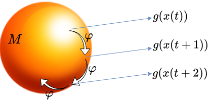

<!-- Course font override -->

## Dynamical Systems Meets Data:   DMD, Koopman, and Reduced Representations

### Andrei Gavrilov and Nathan Mankovich

 

---
## Dynamical Systems Meets Data

### **Part 1: DMD, Koopman, and Reduced Representations**

- Dynamical systems basics, attractors, chaos 
- Meeting data & Koopman operators
- Dynamic mode decomposition & algorithms

### **Part 2: Nonlinearity, Stochasticity, and Forcing** 

 

 

#### Please do ask questions!

---

# What is a dynamical system?

---

## Dynamical System

Dynamical system is a **mathematical object** defined by a state space $M$ and an operator $\varphi_\tau$ defining evolution of any initial state in $M$ over time $\tau >0$:

 

- state space $M$

- evolution operator $\varphi_\tau: M \to M$
  
  $\mathbf{x}(t_0+\tau)=\varphi_{\tau} (\mathbf{x}(t_0))$ for any $\mathbf{x}(t_0) \in M$ and $\tau>0$

- cocycle property $\varphi_{\tau_1+\tau_2} = \varphi_{\tau_2} \circ \varphi_{\tau_1}$

 

 

 

 **Dynamical systems provide a universal language to bridge models and real world**

---

## Dynamical System: example

1st order ordinary differential equation (ODE) / flow: 
$$\dot{\mathbf{x}} = \mathbf{f}(\mathbf{x})$$

 

- state space $M=\mathbb{R}^d$

- evolution operator over time $\tau$:

  $\mathbf{x}(t_0+\tau)=\mathbf{x}(t_0)+\int\limits_{t_0}^{t_0+\tau}\mathbf{f}(\mathbf{x}(t')) d t'$

- cocycle property $\varphi_{\tau_1+\tau_2} = \varphi_{\tau_2} \circ \varphi_{\tau_1}$  (check!)

 

---

## Dynamical System: example

1st order ordinary differential equation (ODE) / flow: 
$$\dot{\mathbf{x}} = \mathbf{f}(\mathbf{x})$$

- continuous or discrete time?

---

## Dynamical System: discrete time

A 1-step map:
$$\mathbf{x}_{t+1} = \mathbf{F}(\mathbf{x}_t)$$

- state space $M=\mathbb{R}^d$
  
- evolution operator over $\tau$ steps: 
   
  $\mathbf{x}_{t+\tau}=\mathbf{F}(\ldots(\mathbf{F}(\mathbf{x}_t)))=\mathbf{F}^{(\tau)}(\mathbf{x}_t)$

- cocycle property $\varphi_{\tau_1+\tau_2} = \varphi_{\tau_2} \circ \varphi_{\tau_1}$  (check!)

 

---

## Dynamical System: discrete time

A 1-step map:
$$\mathbf{x}_{t+1} = \mathbf{F}(\mathbf{x}_t)$$

- state space $M=\mathbb{R}^d$
  
- evolution operator over $\tau$ steps: 
   
  $\mathbf{x}_{t+\tau}=\mathbf{F}(\ldots(\mathbf{F}(\mathbf{x}_t)))=\mathbf{F}^{(\tau)}(\mathbf{x}_t)$

- cocycle property $\varphi_{\tau_1+\tau_2} = \varphi_{\tau_2} \circ \varphi_{\tau_1}$  (check!)

 

Example:
Define 1-step $\mathbf{F}$ as the result of ODE forward integration over time step $\Delta t$
  $~~~~~~~~~~~~~~~~~~~~~~~~~~~~\mathbf{F}(\mathbf{x}(t_0)) := \mathbf{x}(t_0)+\int\limits_{t_0}^{t_0+\Delta t}\mathbf{f}(\mathbf{x}(t')) d t'$

---

## Dynamical System: example

1st order ordinary differential equation (ODE) / flow: 
$$\dot{\mathbf{x}} = \mathbf{f}(\mathbf{x})$$

- **continuous** or discrete time?

- deterministic or stochastic?

---

## Dynamical System: example

1st order ordinary differential equation (ODE) / flow: 
$$\dot{\mathbf{x}} = \mathbf{f}(\mathbf{x})$$

- **continuous** or discrete time?

- **deterministic** or stochastic?

- autonomous or non-autonomous?

---

## Dynamical System: example

1st order ordinary differential equation (ODE) / flow: 
$$\dot{\mathbf{x}} = \mathbf{f}(\mathbf{x})$$

- **continuous** or discrete time?

- **deterministic** or stochastic?

- **autonomous** or non-autonomous?

- linear or nonlinear?

---

## Linear Dynamical System (1D)

Scalar ODE:
$$\dot{x} = \lambda x, \quad \lambda \in \mathbb{R}$$

- solution: $x(t) = e^{\lambda (t-t_0)} x(t_0)$
- evolution operator: $\varphi_\tau(x) = e^{\lambda \tau} x$
- behavior determined by sign of $\lambda$:
  - $\lambda < 0$: decay to zero
  - $\lambda = 0$: constant
  - $\lambda > 0$: exponential growth

---

## Linear Dynamical System (1D)

Scalar map:
$$x_{t+1} = \mu x_t, \quad \mu \in \mathbb{R}$$

- solution: $x_t = \mu^{t-{t_0}} x_{t_0}$
- evolution operator: $\varphi_\tau(x) = \mu^{\tau} x$
- behavior determined by $|\mu|$: 
  - $|\mu|<1$: decay 
  - $|\mu|=1$: constant 
  - $|\mu|>1$: growth
- Link to continuous ODE discretized with the step $\Delta t$: $\mu=e^{\lambda \Delta t}$
  
---

## Linear Dynamical System (2D) 

Example: classic linear oscillator ($q$ — position, $v$ — velocity):

$$\dot{q} = v~~~~~~~~~~~~~~~~~~$$
$$\dot{v} = -\omega^2 q - 2 \gamma v$$

- $\omega$ — frequency 
- $0  \leq \gamma < \omega$ — damping (weak dissipation)
- state vector $\mathbf{x} = (q, v)^\top \in \mathbb{R}^2$

---

## Linear Dynamical System (2D) 

Example: classic linear oscillator ($q$ — position, $v$ — velocity):

$$\dot{q} = v~~~~~~~~~~~~~~~~~~$$
$$\dot{v} = -\omega^2 q - 2 \gamma v$$

- solution ($\gamma < \omega$):
  $$q(t) = e^{-{\gamma}(t-t_0)}\left[ ~~~~~~~~~~~~~~~~~q(t_0)\cos\omega_d(t-t_0) + ~~~~\frac{v(t_0) + {\gamma}q(t_0)}{\omega_d}\sin\omega_d(t-t_0) \right]$$
  
  $$v(t) = e^{-\gamma(t-t_0)}\left[ \left(v(t_0) + \gamma q(t_0)\right)\cos\omega_d(t-t_0) - \frac{\omega^2 q(t_0) + \gamma v(t_0)}{\omega_d}\sin\omega_d(t-t_0) \right]$$

- amplitude decays as $e^{-{\gamma}(t-t_0)}$

- oscillates at damped frequency $\omega_d = \sqrt{\omega^2 - {\gamma^2}}< \omega$

---

## Linear Dynamical System (2D) — complex form

$$\dot{\mathbf{x}} = A\mathbf{x}, \qquad A = \begin{pmatrix} 0 & 1 \\ -\omega^2 & -2\gamma \end{pmatrix}$$

$A$: eigenvalues $\lambda_{1,2} = -\gamma \pm i\omega_d$, eigenvectors $\mathbf{v}_{1,2}$ (right), $\mathbf{w}_{1,2}$ (left)

In the eigenbasis $z_{1,2} = \mathbf{w}_{1,2}^\top \mathbf{x}$:

  $$\dot{z}_{1,2} = \lambda_{1,2} z_{1,2}$$

Solution: 
$$z_{1,2}(t) = e^{\lambda_{1,2}(t-t_0)} z_{1,2}(t_0) = e^{(-\gamma \pm i\omega_d)(t-t_0)} z_{1,2}(t_0)$$

- $e^{\pm i\omega_d(t-t_0)}$ — **rotation** in the complex plane with angular frequency $\pm \omega_d$
- $e^{-\gamma(t-t_0)}$ — **scaling** (decay)

Complex eigenvalues $\Leftrightarrow$ oscillatory (rotating) behavior in 2D

---

## Linear Dynamical System (2D) — complex form

$$\dot{\mathbf{x}} = A\mathbf{x}, \qquad A = \begin{pmatrix} 0 & 1 \\ -\omega^2 & -2\gamma \end{pmatrix}$$

$A$: eigenvalues $\lambda_{1,2} = -\gamma \pm i\omega_d$, eigenvectors $\mathbf{v}_{1,2}$ (right), $\mathbf{w}_{1,2}$ (left)

In the eigenbasis $z_{1,2} = \mathbf{w}_{1,2}^\top \mathbf{x}$:

  $$\dot{z}_{1,2} = \lambda_{1,2} z_{1,2}$$

Solution: 
$$z_{1,2}(t) = e^{\lambda_{1,2}(t-t_0)} z_{1,2}(t_0) = e^{(-\gamma \pm i\omega_d)(t-t_0)} z_{1,2}(t_0)$$

Switch to original basis: 

  $$\mathbf{x}(t) = z_1(t)\,\mathbf{v}_1 + z_2(t)\,\mathbf{v}_2 = 2\,e^{-\gamma(t-t_0)}\,\text{Re}\!\left[e^{i\omega_d(t-t_0)} z_1(t_0)\,\mathbf{v}_1\right]$$

---

## Trajectory

- A **trajectory** (orbit) is a curve $t \mapsto \mathbf{x}(t) \in M$ satisfying:
$$\mathbf{x}(t_2) = \varphi_{t_2-t_1}(\mathbf{x}(t_1)), \qquad t_2 \geq t_1$$

- The **phase portrait** is the collection of all trajectories in $M$. It reveals the global geometry of the dynamical system

- For a continuous dynamical system 
  - for any $\mathbf{x}^* \in M$ there exists exactly one trajectory passing through $\mathbf{x}^*$, and distinct trajectories **never intersect**

  - $\mathbf{f}(\mathbf{x})$ is the velocity along the trajectory

---

## Fixed point (equilibrium)

A **fixed point** (equilibrium) is a special trajectory $\mathbf{x}(t) = \mathbf{x}^*$ for all $t$, defined by:

$$\mathbf{f}(\mathbf{x}^*) = \mathbf{0} \quad \text{(continuous)}, \qquad \mathbf{F}(\mathbf{x}^*) = \mathbf{x}^* \quad \text{(discrete)}$$

Examples:

- **Linear 1D** — $\dot{x} = \lambda x$: unique equilibrium $x^* = 0$ for any $\lambda$

- **Linear 2D** — $\dot{\mathbf{x}} = A\mathbf{x}$: unique equilibrium $\mathbf{x}^* = \mathbf{0}$ if $\det(A) \neq 0$

---

## Stability of fixed point

- A fixed point $\mathbf{x}^*$ is **stable** if trajectories starting close to $\mathbf{x}^*$ converge to it:

$$\|\mathbf{x}(t_0) - \mathbf{x}^*\| < \delta \implies \|\mathbf{x}(t) - \mathbf{x}^*\| \to 0 \quad \text{as } t \to \infty$$

- A fixed point is **unstable** if arbitrarily small perturbations lead to large deviations from $\mathbf{x}^*$.

- A fixed point is **non-hyperbolic** if some trajectories starting near $\mathbf{x}^*$ neither converge to it nor escape from it. It is structurally unstable under small perturbations to the system

---

## Linear Dynamical System (2D) 

Matrix form:
$$\dot{\mathbf{x}} = A\mathbf{x}, \quad A \in \mathbb{R}^{2\times 2}, \quad \mathbf{x} \in \mathbb{R}^2$$

- solution: $\mathbf{x}(t) = e^{At}\mathbf{x}(0)$
- behavior governed by eigenvalues $\lambda_{1,2}$ of $A$

Example — classic linear oscillator:
$$A = \begin{pmatrix} 0 & 1 \\ -\omega^2 & -2\gamma \end{pmatrix}$$

- $\gamma = 0$: pure oscillation (non-hyperbolic), eigenvalues $\lambda = \pm i\omega$
- $\gamma > 0$: damped oscillation (stable), $\text{Re}(\lambda) < 0$

---

## Linear Dynamical System (2D): eigenvalue cases

Behavior of $\dot{\mathbf{x}} = A\mathbf{x}$ determined by eigenvalues $\lambda_{1,2}$:

**Complex eigenvalues** $\lambda = \alpha \pm i\beta$, $\beta \neq 0$:

- $\alpha < 0$: **stable focus** — spiral inward
- $\alpha = 0$: **center** — closed orbits
- $\alpha > 0$: **unstable focus** — spiral outward

**Real eigenvalues** $\lambda_1, \lambda_2 \in \mathbb{R}$:

- $\lambda_2 < \lambda_1 < 0$: **stable node** — decay along both eigenvectors
- $\lambda_2 < 0 < \lambda_1$: **saddle** — attract along one, repel along other
- $0 < \lambda_2 < \lambda_1$: **unstable node** — growth along both eigenvectors

**Key quantity**: $\text{Re}(\lambda_i) < 0$ for all $i$ $\Leftrightarrow$ **stable** (all trajectories decay to origin)

---

## Stability of a trajectory: Lyapunov exponents

Consider a perturbation $\boldsymbol{\delta}(t_0)$ to initial condition $\mathbf{x}(t_0)$ of a trajectory $\mathbf{x}(t)$.

- In a linear system perturbation satisfies $\dot{\boldsymbol{\delta}} = A\boldsymbol{\delta}$, so:

$$\boldsymbol{\delta}(t) = e^{A(t-t_0)}\boldsymbol{\delta}(t_0) = \sum_i c_i\, e^{\lambda_i(t-t_0)}\mathbf{v}_i, \qquad c_i = \mathbf{w}_i^\top \boldsymbol{\delta}(t_0)$$

- Each component grows or decays independently with rate $\sigma_i = \text{Re}(\lambda_i)$.

This motivates the definition: the $i$-th **Lyapunov exponent** is the asymptotic growth rate of $\boldsymbol{\delta}$ along the $i$-th direction $\mathbf{v}_i$:

$$\sigma_i = \lim_{t\to\infty} \frac{1}{t} \ln \frac{\|\boldsymbol{\delta}_i(t)\|}{\|\boldsymbol{\delta}_i(0)\|}$$

- The trajectory is stable if $\sigma_{\max} < 0$ (predictability!)

---

## Linear dynamical system properties

- Linear system has the only fixed point (if $\det(A) \neq 0$)
- Dynamics is fully determined by eigenvalues of $A$ 
- General solution is a superposition of modes $e^{\lambda_i t}\mathbf{v}_i$, each grows or decays independently
- No oscillatory attractors, no chaos

---

# Nonlinear dynamical systems, attractors, chaos

---

## Nonlinear dynamical system (Lorenz-63)

Atmospheric convection toy model:

$$\dot{x} = \sigma(y - x)~~~~~~~$$
$$\dot{y} = x(\rho - z) - y$$
$$\dot{z} = xy - \beta z~~~~~~~~$$

 

- State space $M = \mathbb{R}^3$

- Dynamics depends on the parameters ($\sigma=10,\ \beta=8/3,\ \rho>0$)

---

## Nonlinear dynamical system (Lorenz-63)

 

$$\dot{x} = \sigma(y - x)~~~~~~~$$
$$\dot{y} = x(\rho - z) - y$$
$$\dot{z} = xy - \beta z~~~~~~~~$$

 

How to find fixed points (equilibrium states)?

---

## Nonlinear dynamical system (Lorenz-63)

 

$$\dot{x} = \sigma(y - x)~~~~~~~$$
$$\dot{y} = x(\rho - z) - y$$
$$\dot{z} = xy - \beta z~~~~~~~~$$

 

How to find fixed points (equilibrium states)?

Fixed points ($\mathbf{f}(\mathbf{x}^*) = \mathbf{0}$):

- (0, 0, 0)

- $C^\pm = \left(\pm\sqrt{\beta(\rho-1)},\ \pm\sqrt{\beta(\rho-1)},\ \rho-1\right)$, if $\rho > 1$

---

## Stability of fixed points

**Linearization** around fixed point:

- Given a nonlinear system $\dot{\mathbf{x}} = \mathbf{f}(\mathbf{x})$ near an equilibrium $\mathbf{x}^*$, let $\boldsymbol{\xi} = \mathbf{x} - \mathbf{x}^*$:

$$\dot{\boldsymbol{\xi}} = D\mathbf{f}(\mathbf{x}^*)\,\boldsymbol{\xi} + \mathcal{O}(\|\boldsymbol{\xi}\|^2)$$

- **Jacobian** $J = D\mathbf{f}(\mathbf{x}^*)$ governs local dynamics
- valid for infinitely small perturbations $\boldsymbol{\xi}$

**Hartman–Grobman theorem**: if $J$ has no eigenvalues with $\text{Re}(\lambda)=0$, the nonlinear flow is topologically equivalent to the linear flow $\dot{\boldsymbol{\xi}} = J\boldsymbol{\xi}$ near $\mathbf{x}^*$

### **Stability is determined by the eigenvalues of Jacobian**

---

## Nonlinear dynamical system (Lorenz-63)

$$\dot{x} = \sigma(y - x)~~~~~~~$$
$$\dot{y} = x(\rho - z) - y$$
$$\dot{z} = xy - \beta z~~~~~~~~$$

The Jacobian of $\mathbf{f}$ at any point $(x, y, z)$:

$$J = D\mathbf{f} = \begin{pmatrix} -\sigma & \sigma & 0 \\ \rho - z & -1 & -x \\ y & x & -\beta \end{pmatrix}, \qquad \det(J) = -\sigma\beta(z - \rho + 1) - \sigma x(x+y)$$

- At $\mathbf{x}^* = \mathbf{0}$: $\quad\det(J_0) = \sigma\beta(\rho - 1) > 0$ -- unstable for $\rho > 1$

- At $C^\pm$ for $\rho > 1$: $\quad\det(J_{C^\pm}) = -2\sigma\beta(\rho-1) < 0$ -- can be stable

- [github.com/IPL-UV/dynamical_systems_course](https://github.com/IPL-UV/dynamical_systems_course)

---

## Nonlinear dynamical system (Lorenz-63)

 

---

## Nonlinear dynamical system (Lorenz-63)

 

$$\dot{x} = \sigma(y - x)~~~~~~~$$
$$\dot{y} = x(\rho - z) - y$$
$$\dot{z} = xy - \beta z~~~~~~~~$$

#### **Where do the trajectories go if all equilibrium points are unstable?**

The system is globally stable:

There exists an ellipsoid $a x^2 + b y^2 + c z^2 = r^2$ which traps all incoming trajectories (all $r>r_0$)

---

## Attractor

A set $\mathcal{A} \subset M$ is an **attractor** if:

1. $\mathcal{A}$ is forward invariant: $\varphi_t(\mathcal{A}) \subseteq \mathcal{A}$ for all $t > 0$

2. There exists an open neighborhood $U \supset \mathcal{A}$ such that:
$$\varphi_t(\mathbf{x}) \to \mathcal{A} \quad \text{as } t \to \infty \quad \forall \mathbf{x} \in U$$

3. There is no non-empty subset of $\mathcal{A}$ satisfying both properties above

The **basin of attraction** $B(\mathcal{A})$ is the set of all $\mathbf{x} \in M$ whose trajectories converge to $\mathcal{A}$.

---

## Nonlinear dynamical system (Lorenz-63)

 

 

 

 

---

## Stability of a trajectory: Lyapunov exponents

Measure the **average rate of divergence** of nearby trajectories.

For a trajectory $\mathbf{x}(t)$ and perturbation $\boldsymbol{\delta}(t)$:
$$\dot{\boldsymbol{\delta}} = D\mathbf{f}(\mathbf{x}(t))\,\boldsymbol{\delta}$$

The $i$-th Lyapunov exponent:
$$\sigma_i = \lim_{t\to\infty} \frac{1}{t} \ln \frac{\|\boldsymbol{\delta}_i(t)\|}{\|\boldsymbol{\delta}_i(0)\|}$$

---

## Lyapunov exponents of an attractor

Measure the **average rate of divergence** of nearby trajectories.

For a trajectory $\mathbf{x}(t)$ and perturbation $\boldsymbol{\delta}(t)$:
$$\dot{\boldsymbol{\delta}} = D\mathbf{f}(\mathbf{x}(t))\,\boldsymbol{\delta}$$

The $i$-th Lyapunov exponent:
$$\sigma_i = \lim_{t\to\infty} \frac{1}{t} \ln \frac{\|\boldsymbol{\delta}_i(t)\|}{\|\boldsymbol{\delta}_i(0)\|}$$

- $\sigma_{\max} < 0$: all perturbations decay, **stable fixed point**
- $\sigma_{\max} = 0$: there is neutral direction (e.g. along trajectory in a limit cycle)
- $\sigma_{\max} > 0$: **sensitive dependence on initial conditions = chaos**

Lorenz-63: $\sigma_1 \approx 0.91,\ \sigma_2 = 0,\ \sigma_3 \approx -14.57$

---

## Nonlinear dynamical system (Lorenz-63)

 

---

# Dynamical systems meets data

---

## Dynamical systems meets data

So far: dynamical system is defined on a state space $M$, but in practice **we do not know $M$** or $\varphi$, they are latent (hidden).

 

We only observe some variables:
$$y(t) = g(\mathbf{x}(t)), \qquad g: M \to \mathbb{R}^k$$

which may or may not represent the true state, 
e.g. we measure temperature, but the governing equations are for pressure, velocity, density, ...

 

 

- Can we **reconstruct** the dynamics from observations alone?

- Can we find a **linear representation** of nonlinear dynamics?

---

## State space reconstruction: Whitney embedding theorem

**Whitney embedding theorem** (1944): for any smooth $d$-dimensional manifold $M$, a **generic** smooth map $g: M \to \mathbb{R}^{2d+1}$ is an embedding (diffeomorphism)

- "Generic" means: almost any smooth function works, non-generic cases form a set of measure zero
- Diffeomorphisms preserve all dynamical properties: topology of trajectories, Lyapunov exponents, attractor structure, i.e. gives an **equivalent dynamical system** in $\mathbb{R}^{2d+1}$

---

## State space reconstruction: Whitney embedding theorem

**Whitney embedding theorem** (1944): for any smooth $d$-dimensional manifold $M$, a **generic** smooth map $g: M \to \mathbb{R}^{2d+1}$ is an embedding (diffeomorphism)

- "Generic" means: almost any smooth function works, non-generic cases form a set of measure zero
- Diffeomorphisms preserve all dynamical properties: topology of trajectories, Lyapunov exponents, attractor structure, i.e. gives an **equivalent dynamical system** in $\mathbb{R}^{2d+1}$
- In practice we do not know the dimension $d$, determinism or stationarity properties may not hold...
- But still it gives an intuition why $2d+1$ generic measurements (e.g. temperatures at different locations) could be sufficient to represent climate dynamics

---

## State space reconstruction: Takens embedding theorem

**Takens embedding theorem** (1981): for a generic smooth system $\varphi_\tau$ on a $\leq d$-dimensional attractor $\mathcal{A}$ and a generic scalar observation $g: M \to \mathbb{R}$, the **delay coordinate**:

$$\mathbf{y}(t) = \left(g(\mathbf{x}(t)),\ g(\varphi_\tau(\mathbf{x}(t))),\ g(\varphi_{2\tau}(\mathbf{x}(t))),\ \ldots,\ g(\varphi_{2d\tau}(\mathbf{x}(t)))\right)$$

is an **embedding** (diffeomorphism) of $\mathcal{A}$ in $\mathbb{R}^{2d+1}$ for any $\tau$

- Practically, dynamics can be reconstructed from a **single scalar time series** $g(\mathbf{x}(t_0)), g(\mathbf{x}(t_1)), \ldots$ 

---

## State space reconstruction: Takens embedding theorem

**Takens embedding theorem** (1981): for a generic smooth system $\varphi_\tau$ on a $\leq d$-dimensional attractor $\mathcal{A}$ and a generic scalar observation $g: M \to \mathbb{R}$, the **delay coordinate**:

$$\mathbf{y}(t) = \left(g(\mathbf{x}(t)),\ g(\varphi_\tau(\mathbf{x}(t))),\ g(\varphi_{2\tau}(\mathbf{x}(t))),\ \ldots,\ g(\varphi_{2d\tau}(\mathbf{x}(t)))\right)$$

is an **embedding** (diffeomorphism) of $\mathcal{A}$ in $\mathbb{R}^{2d+1}$ for any $\tau$

- Practically, dynamics can be reconstructed from a **single scalar time series** $g(\mathbf{x}(t_0)), g(\mathbf{x}(t_1)), \ldots$ 

- In contrast, $2d+1$ functions of a single value $g(\mathbf{x})$ are not generic in Whitney's sense, they define a 1D curve in $\mathbb{R}^{2d+1}$, not an embedding of $\mathcal{A}$

---

## Linear representation: Koopman Operator

Consider a linear space $G$ of observable functions $g(\mathbf{x})$, $\mathbf{x} \in M$, e.g. $g: M \to \mathbb{C}$

For a dynamical system $\mathbf{x}(t+\tau) = \varphi_\tau(\mathbf{x}(t))$, the **Koopman operator** $\mathcal{K}^\tau$ acts on **observable functions** $g \in G$:

$$\mathcal{K}^\tau g = g \circ \varphi_\tau, \qquad \text{i.e.} \qquad (\mathcal{K}^\tau g)(\mathbf{x}) = g(\varphi_\tau(\mathbf{x}))$$

- $\mathcal{K}^\tau$ is an evolution operator for observable functions: $g(\mathbf{x}(t+\tau)) = (\mathcal{K}^\tau g)(\mathbf{x}(t))$
- $\mathcal{K}^\tau$ is **linear**: $\mathcal{K}^\tau(\alpha g + \beta f) = \alpha\, \mathcal{K}^\tau g + \beta\, \mathcal{K}^\tau f$
- Acts on an **infinite-dimensional** space

---

## Koopman Operator: linear dynamical system for observables

Consider a linear space $G$ of observables $g(\mathbf{x})$, $\mathbf{x} \in M$, e.g. $g: M \to \mathbb{C}$

For a dynamical system $\mathbf{x}(t+\tau) = \varphi_\tau(\mathbf{x}(t))$, the **Koopman operator** $\mathcal{K}^\tau$ acts on **observables** $g \in G$:

$$\mathcal{K}^\tau g = g \circ \varphi_\tau, \qquad \text{i.e.} \qquad (\mathcal{K}^\tau g)(\mathbf{x}) = g(\varphi_\tau(\mathbf{x}))$$

- $\mathcal{K}^\tau$ is an evolution operator for observables (functions of the state): $g(\mathbf{x}(t+\tau)) = (\mathcal{K}^\tau g)(\mathbf{x}(t))$
- $\mathcal{K}^\tau$ is **linear**: $\mathcal{K}^\tau(\alpha g + \beta f) = \alpha\, \mathcal{K}^\tau g + \beta\, \mathcal{K}^\tau f$ 
- Acts on an **infinite-dimensional** space
- If $G$ is a space with inner product (Hilbert space), then we can define a complete basis $\{\psi_k\}$, decomposition along the basis $g = \sum_k \langle g, \psi_k \rangle\, \psi_k$, eigenvalues, eigenmodes ... 

---

## Koopman operator: linear representation of chaos?

- Nonlinear dynamical systems can have chaotic attractors
- Linear dynamical systems do not
- Koopman theory claims nonlinear dynamics can be represented linearly

Paradox?

---

## Koopman operator: linear representation of chaos?

- Nonlinear dynamical systems can have chaotic attractors
- Linear dynamical systems do not
- Koopman theory claims nonlinear dynamics can be represented linearly

So where did the chaos go?
- **Into an infinite-dimensional space of observables (functions)**
- The dynamics become linear, but the spectrum of a linear operator on a function space can be far richer than that of a finite-dimensional matrix. Welcome to functional analysis!
- In practice, finite Koopman approximation can only predict in finite time
 - [github.com/IPL-UV/dynamical_systems_course](https://github.com/IPL-UV/dynamical_systems_course)

---

## Take-home messages

- Dynamical systems provide a universal language connecting mathematics, physics, observations, and models
- Linear systems are simple because eigenvalues tell the whole story
- Nonlinear systems can produce attractors, bifurcations, and chaos
- Chaos limits predictability but does not imply randomness
- Observations can contain enough information to reconstruct hidden dynamics
- Koopman theory reveals a surprising fact: nonlinear dynamics can be represented by a linear operator 

 

- *Next*: DMD, Koopman mode decomposition, reduced representations
