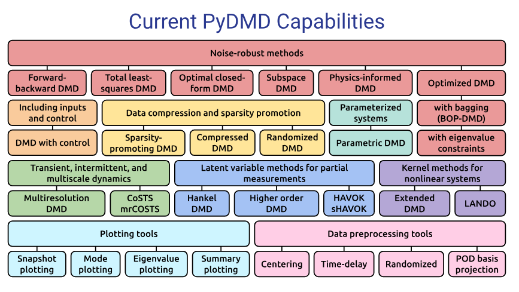
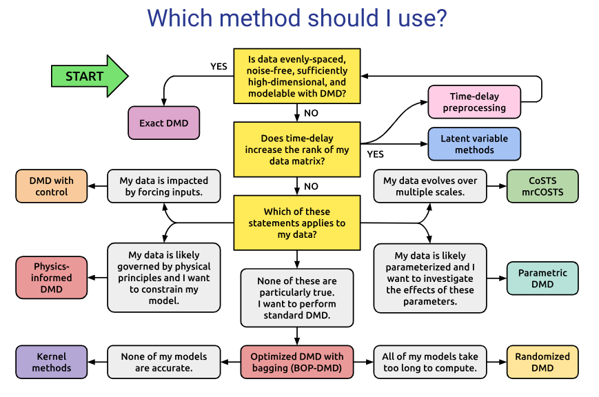

<!-- Course font override -->

# Dynamical Systems Meets Data: 
## DMD, Koopman, and Reduced Representations

### Andrei Gavrilov and Nathan Mankovich

---

<!-- _class: small -->

## What we've seen so far...

In session 1, we built the foundation for data-driven dynamics:

- What a dynamical system is: state space, flow/map, trajectories, phase portrait
- Linear systems: eigenvalues, modes, stability, and oscillations
- Nonlinear systems: fixed points, attractors, and chaos (Lorenz-63)
- Predictability through Lyapunov exponents
- Why observations can still encode hidden state dynamics (Whitney/Takens intuition)
- Core idea for this session: represent nonlinear dynamics linearly in observable space (Koopman)

---

<!-- _class: small -->

## What's next?

- Session 1: dynamical systems basics, attractors, chaos, and Koopman motivation
- **Session 2 (today): from theory to algorithms and practice**
	- Dynamic Mode Decomposition (DMD): derivation, interpretation, and variants
	- Exact DMD workflow
	- Koopman mode decomposition through finite-dimensional approximation (EDMD)
	- Eigenvalues, eigenfunctions, and dynamic modes for nonlinear systems
	- How this maps directly to the lab pipeline and notebook implementation

---

<!-- _class: small -->

## From Concepts To Operators

- Session 1 asked: can we reconstruct and linearize nonlinear dynamics from data?
- Session 2 answers: yes, by fitting linear operators in the right coordinates.

Today we move from:

- geometric and stability intuition (state space)

to:

- spectral algorithms (DMD/Koopman) that produce actionable models from snapshots.

---

## Linear Dynamical System
Start with a linear dynamical system in state space:

$$
\dot{\mathbf{x}} = \mathbf{L}\mathbf{x}, \quad \mathbf{x}(0)=\mathbf{x}_0
$$

Discrete-time system in state space:

$$
\mathbf{x}(t+\tau) = \mathbf{A}\mathbf{x}(t),
\qquad
\mathbf{A} = e^{\mathbf{L}\tau} \in\mathbb{R}^{d\times d}.
$$

Iterating the map gives

$$
\mathbf{x}(k\tau) = \mathbf{A}^k\mathbf{x}_0.
$$

- $\mathbf{A}$ is the transition operator of the discrete-time dynamical system.
- So understanding the behavior of the system means understanding powers of $\mathbf{A}$.

---

## Eigendecomposition Of The Transition Operator
If $\mathbf{A}$ is diagonalizable, then
$$
\mathbf{A} = \mathbf{M}\mathbf{\Lambda}\mathbf{M}^{-1},
\qquad
\mathbf{\Lambda}=\mathrm{diag}(\lambda_1,\ldots,\lambda_n),
$$

where the columns of $\mathbf{M}=[\mathbf{m}_1|\cdots|\mathbf{m}_n]$ are eigenvectors with corresponding eigenvalues $\lambda_1, \lambda_2, \dots, \lambda_n$.

Then we have the **Dynamic Mode Decomposition** ([Schmid 2010](https://www.cambridge.org/core/journals/journal-of-fluid-mechanics/article/abs/dynamic-mode-decomposition-of-numerical-and-experimental-data/AA4C763B525515AD4521A6CC5E10DBD4))

$$
\mathbf{x}(k\tau) = \mathbf{A}^k \mathbf{x}_0 = \mathbf{M}\mathbf{\Lambda}^k\mathbf{M}^{-1}\mathbf{x}_0 = \mathbf{M}\mathbf{\Lambda}^k\boldsymbol{\phi}
= \sum_{j=1}^n \mathbf{m}_j\lambda_j^k\phi_j,
\qquad
\boldsymbol{\phi}=\mathbf{M}^{-1}\mathbf{x}_0.
$$

- $\lambda_j \in \mathbb{C}$: **discrete time** eigenvalues *(eventhough they were continuous session 1)*
- $\mathbf{m}_j \in \mathbb{C}^d$: spatial modes / eigenvectors
- $\phi_j \in \mathbb{C}$: loadings from the initial condition
---

## Link To Continuous Time

If the discrete-time map $\mathbf{A}$ comes from sampling a continuous-time system every $\tau$ units, then the discrete and continuous eigenvalues are related by

$$
\lambda_j = a_j + b_j i = e^{\omega_j \tau},
\qquad
\omega_j = \frac{1}{\tau}\log(\lambda_j).
$$

- $|\lambda_j|<1$: decay per time step
- $|\lambda_j|>1$: growth per time step
- $\arg(\lambda_j) = \mathrm{Im}(\omega_j)$: oscillation angle per time step
- $\mathrm{Re}(\omega_j)$ and $\mathrm{Im}(\omega_j)$ give continuous-time growth/decay and oscillation rates

---

<!-- _class: small -->

## Dynamic Mode Decomposition (summary)

Starting from

$$
\mathbf{x}(t+\tau) = \mathbf{A}\mathbf{x}(t)
$$

iterate in discrete time ($m=t/\tau$):

$$
\mathbf{x}(t) = \mathbf{A}^{m}\mathbf{x}_0, \quad \mathbf{x}(0)=\mathbf{x}_0
$$

If $\mathbf{A}=\mathbf{M}\mathbf{\Lambda}\mathbf{M}^{-1}$ and $\boldsymbol{\phi}=\mathbf{M}^{-1}\mathbf{x}(0)$, then

$$
\mathbf{x}(t)
=
\mathbf{W}\mathbf{\Lambda}^{m}\boldsymbol{\phi}
=
\sum_{j=1}^{k}\mathbf{m}_j\lambda_j^{t/\tau} \phi_j
=
\sum_{j=1}^{k}\mathbf{m}_j e^{\omega_j t} \phi_j
$$

Timeseries parameterized by $t$, $e^{\omega_j t} \phi_j$, is *temporal dynamics* of dynamic mode $\mathbf{m}_j$

---

## Meet the data ... now we use our model in the real world!

<!-- _class: small -->

Consider the timeseries of samples $\{ \mathbf{x}_0, \mathbf{x}_1, \dots, \mathbf{x}_p \} \subset \mathbb{R}^n$ 

What if $n$ is really, really big?

Enter *feature extraction* via rank $k$-truncated **Singular Value Decomposition**

$$[\, \mathbf{x}_0 \, | \, \mathbf{x}_1 \, | \, \cdots \, | \, \mathbf{x}_p\, ] = \mathbf{X} \approx \mathbf{U} \boldsymbol{\Sigma} \mathbf{V}^\top$$

where $k < n$ and

$$
\mathbf{U} =
[\, \mathbf{u}_1 \, | \, \mathbf{u}_2 \, | \, \cdots \, | \, \mathbf{u}_k\, ]
\in \mathbb{R}^{n \times k},
\quad
\Sigma =
\begin{bmatrix}
\sigma_1 &        &        & 0 \\
          & \sigma_2 &      &   \\
          &        & \ddots &   \\
0         &        &        & \sigma_k
\end{bmatrix}
\in \mathbb{R}^{r \times r},
\quad
\mathbf{V} =
[\, \mathbf{v}_1 \, | \, \mathbf{v}_2 \, | \, \cdots \, | \, \mathbf{v}_k\, ]
\in \mathbb{R}^{p \times k},
$$
If timeseries mean-centered, this is Principal Component Analysis PCA, a.k.a. Empirical Orthognal Function Analysis (EOF Analysis) with EOFs $\mathbf{U}$ and PCs $\boldsymbol{\Sigma} \mathbf{V}^\top$.

---

<!-- _class: small -->

## DMD as Feature Extraction Then Regression

1. Feature extraction (map snapshots to rank-$k$ subspace):

$$
\mathbf{z}_k = \mathbf{U}^{\top}\mathbf{x}_k,
\qquad
\mathbf{U} \in \mathbb{R}^{n\times k},\ \mathbf{U}^{\top}\mathbf{U}=\mathbf{I}.
$$

2. Regression in reduced space (fit reduced propagator $\widetilde{\mathbf{A}}$):

$$
\widetilde{\mathbf{A}}
:= \arg\min_{\widetilde{\mathbf{A}}}\|\mathbf{Z}'-\widetilde{\mathbf{A}}\mathbf{Z}\|_F,
\qquad
\mathbf{Z}=[\,\mathbf{z}_0\, | \, \ldots \, | \, \mathbf{z}_{p-1}\,],\
\mathbf{Z}'=[\,\mathbf{z}_2\, | \, \ldots \, | \, \mathbf{z}_p\,].
$$

Eigendecomposition of the fitted reduced operator:

$$
\widetilde{\mathbf{A}}\mathbf{W}=\mathbf{W}\mathbf{\Lambda},
\qquad
\mathbf{\Lambda}=\mathrm{diag}(\lambda_1,\ldots,\lambda_k).
$$

- Eigenvalues: $\lambda_j$ (entries of $\mathbf{\Lambda}$), controlling growth/decay and oscillation.
- Dynamic modes in ambient space: $\mathbf{m}_j = \mathbf{U}\mathbf{w}_j$.
- Loadings: $\boldsymbol{\phi}$ from $\mathbf{M}\boldsymbol{\phi}=\mathbf{x}_0$, with $\mathbf{M}=[\,\mathbf{m}_1\, | \, \cdots\, | \, \mathbf{m}_k\,]$.

---

<!-- _class: small -->

## Eigendecomposition: Ambient Vs Reduced

Eigendecomposition of the reduced operator:

$$
\widetilde{\mathbf{A}}\mathbf{W}=\mathbf{W}\mathbf{\Lambda},
\qquad
\mathbf{\Lambda}=\mathrm{diag}(\lambda_1,\ldots,\lambda_k).
$$

Connection to ambient-space operator $\mathbf{A}$:

$$
\mathbf{A} \approx \mathbf{U}\widetilde{\mathbf{A}}\mathbf{U}^\top
\quad\Longrightarrow\quad
\mathbf{A}(\mathbf{U}\mathbf{W}) \approx (\mathbf{U}\mathbf{W})\mathbf{\Lambda} \Longrightarrow \mathbf{A}\mathbf{M} \approx \mathbf{M}\mathbf{\Lambda}.
$$

- So the eigenvalue decomposition of the fitted reduced operator $\widetilde{\mathbf{A}}$
  gives the projected eigenstructure of the ambient transition operator $\mathbf{A}$ *without having to directoy fit $\mathbf{A}$ to our data.*

**Issue: *What if $\widetilde{\mathbf{A}}$ is not diagonalizable?***
We have to approximate $\boldsymbol{\phi}$ by solving $\mathbf{M}\boldsymbol{\phi} = \mathbf{x}_0$ using: (1) left eigenvectors of $\widetilde{\mathbf{A}}$, (2) pesudoinverse of $\mathbf{M}$, (3) least squares, etc.

---

<!-- _class: small -->

## Other DMD Algorithms

DMD (even Koopman) algorithms are different variations to steps (1) *feature extraction* and (2) *regression* in reduced space.

Here we discuss

- Exact Dynamic Mode Decomposition 
(SVD compression + linear regression, in 1 step)
- Physics Informed Dynamic Mode Decomposition 
(SVD compression + linear regression with contstraints, in 1 step) 
- Extended Dynamic Mode Decomposition 
(Choose your feature extraction method + linear regression)

---

<!-- _class: small -->

## Exact DMD [[Tu et al. 2013](https://arxiv.org/pdf/1312.0041)]

1. Stack the data into *snapshot matrices*

$$
\mathbf{X} = [\,\mathbf{x}_0\, | \, \ldots \, | \, \mathbf{x}_{p-1}\,],
\quad
\mathbf{Y} = [\,\mathbf{x}_1\, | \, \ldots \, | \, \mathbf{x}_{p}\,]
$$

2. Want to solve

$$
\min_{\mathbf{A}} \|\mathbf{Y} - \mathbf{A}\mathbf{X}\|_F
$$

3. Rank-$r$ truncated SVD $\mathbf{X} = \mathbf{U}\mathbf{\Sigma}\mathbf{V}^{\top}$ leads to

$$
\mathbf{A}_\star = \mathbf{Y}\mathbf{X}^{\dagger},
\quad
\mathbf{X}^{\dagger} \approx \mathbf{V}\mathbf{\Sigma}^{-1}\mathbf{U}^{\top}
$$

$$
\widetilde{\mathbf{A}} = \mathbf{U}^{\top}\mathbf{A} \mathbf{U} = \mathbf{U}^{\top}\mathbf{Y}\mathbf{V}\mathbf{\Sigma}^{-1} \in \mathbb{R}^{k\times k},
$$

4. Eigendecomposition 
$$\widetilde{\mathbf{A}}\mathbf{W} = \mathbf{W}\mathbf{\Lambda}$$

---

<!-- _class: small -->

## Exact DMD (continued)

4. Dynamic modes

$$
\mathbf{m}_j = \mathbf{Y}\mathbf{V}\mathbf{\Sigma}^{-1}\mathbf{w}_j
$$

5. Eigenvalues (discrete time)

$$
\lambda_j = e^{\omega_j\tau}
$$

6. Loadings $\boldsymbol{\phi}$ found by solving

$$
\mathbf{M}\boldsymbol{\phi} = \mathbf{x}(0)
$$

---

<!-- _class: small -->

## Physics-informed DMD [[Baddoo et al., 2021](https://arxiv.org/pdf/2112.04307)]

Enforce physical structure when fitting propogator $\mathbf{A}$:

$$
\mathbf{A}_{\mathrm{PI}}
:= \arg\min_{\mathbf{A}\in\mathcal{C}}\|\mathbf{Y}-\mathbf{A}\mathbf{X}\|_F^2
\quad
(\text{or }\arg\min_{\mathbf{A}\in\mathcal{C}}\|\mathbf{Y}-\mathbf{A}\mathbf{X}\|_F^2+\gamma\,\mathcal{R}(\mathbf{A})).
$$

- $\mathcal{C}$ encodes known structure (examples):
	- stability constraints (e.g., spectral radius $\rho(\mathbf{A})\le 1$ in discrete time)
	- symmetry / skew-symmetry / block structure from governing equations
	- sparsity, bandedness, or locality constraints
- This keeps DMD data-driven, but restricts $\mathbf{A}$ to physically admissible reduced dynamics.
- Modes, eigenvalues, and loadings are computed from $\mathbf{A}_{\mathrm{PI}}\mathbf{M}=\mathbf{M}\mathbf{\Lambda}$ as usual.

---

## Standard DMD Limitations

DMD assumes a *linear discrete time autonomous dynamical system*

- Mode Mixing
- No uncertainty quantification or statistical significance assessment
- Best for stationary oscillatory or exponential behavior
- Exact DMD is not robust to noise -> Kutz reccomends [Optimized DMD](https://arxiv.org/pdf/1704.02343)
- Difficult to interpret complex patterns from dynamic modes -> [phasor notation](https://arxiv.org/pdf/2509.03183)

- Linear evolution between snapshots -> Try Extended DMD and Koopman theory (next section)

---

## What about Code?... [[PyDMD](https://github.com/PyDMD)]

---

## Choosing the Right DMD [[PyDMD](https://github.com/PyDMD)]

---

## Further Reading

*There are MANY variants of DMD*

- [Multiverse of DMD](https://arxiv.org/pdf/2312.00137)
- [Generalizing DMD: Modern Koopman theory](https://arxiv.org/pdf/2102.12086)

---

<!-- _class: small -->

## Transition To Koopman

- DMD gives the core idea
estimate a *linear operator* from data and *analyze its spectrum.*

- Koopman is the 
*nonlinear extension* of the DMD story.

- For nonlinear systems, we keep that same DMD idea... but!
move from state space to *observable space*.

---

## Koopman Operators

---

<!-- _class: small -->

## Koopman Operators

Koopman theory predicts the evolution of **observables** (a.k.a. feature functions) $\psi$, not necessarily the state itself.

**Koopman operator** (denoted $\mathcal{K}_\tau$) ([Koopman 1931](https://www.pnas.org/doi/pdf/10.1073/pnas.17.5.315)):

$$
\mathcal{K}_{\tau}\psi(\mathbf{x}(t))
=
\psi\bigl(\mathcal{F}_{\tau}\mathbf{x}(t)\bigr)
=
\psi\bigl(\mathbf{x}(t+\tau)\bigr)
$$

- The state dynamics $\mathcal{F}_\tau$ may be nonlinear.
- The Koopman operator is linear, even when $\mathcal{F}_\tau$ is not.

---

## Koopman Mode Decomposition

Assume a spectral expansion of the Koopman operator:

$$
\mathcal{K}_\tau \varphi_j = \lambda_j \varphi_j.
$$

Then observables admit the decomposition

$$
\boldsymbol{\psi}(\mathbf{x}(t))
=
\sum_{j=1}^k
\lambda_j^t \, \varphi_j(\mathbf{x}(0)) \, \mathbf{m}_j,
$$

where:
- $\lambda_j$ are Koopman *eigenvalues* (growth/decay + oscillations),
- $\varphi_j$ are Koopman *eigenfunctions* (loadings),
- $\mathbf{m}_j$ are Koopman *modes* (spatial structures).

---

## What do we need for the Koopman operator to work?

Enter the **full-state observable** (a vector with entries observables $g_j$)

$$
\mathbf{g}(\mathbf{x}) = \mathbf{x},
\qquad
\mathbf{g}=[g_1,\ldots,g_n]^\top,
$$

- each component $g_i$ is treated as a scalar observable in the Koopman function space.
- This is the key bridge between nonlinear state evolution and linear observable evolution.

---

<!-- _class: small -->

## Why the full-state observable matters

Choosing $\mathbf{g}(\mathbf{x}) = \mathbf{x}$ gives:
- State reconstruction from Koopman eigenfunctions
  (exact if components of $\mathbf{g}$ lie in their span):
	$$\mathbf{x}=\mathbf{g}(\mathbf{x})=\sum_{j=1}^{r} \mathbf{m}_j\,\phi_j(\mathbf{x})$$
- One-step evolution in Koopman form:
	$$\mathcal{F}_{\tau}(\mathbf{x})=(\mathcal{K}_{\tau}\mathbf{g})(\mathbf{x})\approx\sum_{j=1}^{r} \lambda_j\,\mathbf{m}_j\,\phi_j(\mathbf{x})$$
- $\mathbf{m}_j$ are Koopman modes (state-space spatial patterns).
- This is state-space interpretation used in DMD/Koopman mode decomposition.

---

<!-- _class: small -->

## Linear Koopman = DMD

If *we choose the obser*vable map to be the linear (e.g., EOFs),

$$
\boldsymbol{\psi}(\mathbf{x}) = \mathbf{U}^\top \mathbf{x},
$$

ten the finite-dimensio

Note: as with DMD continuous eigenvalues $\omega$ are $\lambda = e^{\omega \tau}$
nal Koopman update becomes

$$
\boldsymbol{\psi}_{k+1} = \mathbf{K}\boldsymbol{\psi}_k
\qquad \Longrightarrow \qquad
\mathbf{x}_{k+1} \approx \mathbf{U}\mathbf{K}\mathbf{U}^\top \mathbf{x}_k.
$$

The Koopman matrix is exactly the same linear evolution operator used in DMD

- DMD is the special case of Koopman analysis with *linear* lifting.
- Koopman methods generalize DMD by replacing $\mathbf{U}^\top \mathbf{x}$ with richer observables $\boldsymbol{\psi}(\mathbf{x})$.

---

<!-- _class: small -->

## Other Observable Dictionary Examples

For $\mathbf{x} \in \mathbb{R}^d$, typical choices for
$\boldsymbol{\psi}(\mathbf{x})=[\psi_1(\mathbf{x}),\ldots,\psi_m(\mathbf{x})]^\top$ are:

- Identity:
	$\boldsymbol{\psi}(\mathbf{x}) = \mathbf{x}$

- Linear map:
	$\boldsymbol{\psi}(\mathbf{x}) = \mathbf{U}_r^{\top}(\mathbf{x}-\boldsymbol{\mu})$

- Polynomial features (total degree $\le p$):
	$\psi_{\alpha}(\mathbf{x}) = \mathbf{x}^{\alpha} = \prod_{i=1}^{d} x_i^{\alpha_i},\ \ |\alpha|\le p$

---

<!-- _class: small -->

## Observable Dictionary Examples  (continued)

Two common ways to enrich the observable space beyond static features are:

- Time-delay embeddings:
	$$\boldsymbol{\psi}(\mathbf{x}_k)=[\mathbf{x}_k^\top,\mathbf{x}_{k-1}^\top,\ldots,\mathbf{x}_{k-q}^\top]^\top $$
	which incorporates short trajectory history into the lifted state.

- Neural-network dictionary:
	$\boldsymbol{\psi}(\mathbf{x}) = f_{\theta}(\mathbf{x}) \in \mathbb{R}^m$
	(e.g., hidden-layer activations or final embedding)

---

<!-- _class: small -->

## Kernel Koopman Mode Decomposition

Kernel Koopman / kernel EDMD ([Williams et al. 2015](https://arxiv.org/pdf/1411.2260), [Klus et al. 2017](https://arxiv.org/pdf/1712.01572)) generalizes EDMD by replacing an explicit finite dictionary with an implicit feature space.

Given a kernel $k(\mathbf{x},\mathbf{x}')$, we interpret it as an inner product

$$
k(\mathbf{x},\mathbf{x}') = \langle \boldsymbol{\psi}(\mathbf{x}),\boldsymbol{\psi}(\mathbf{x}') \rangle.
$$

Then the Koopman fit can be written entirely in terms of Gram matrices, so the algorithm never needs to form
$\boldsymbol{\psi}(\mathbf{x})$ explicitly.

- EDMD: choose a finite dictionary $\boldsymbol{\psi}(\mathbf{x})$ directly.
- Kernel EDMD: choose a kernel and let the dictionary be implicit.
- Same Koopman idea, different representation of the lifted space.

---

<!-- _class: small -->

## Random Fourier Features And Kernel Koopman

Random Fourier features provide an explicit approximation to shift-invariant kernels such as the RBF kernel.

For an RBF kernel, one can sample frequencies $\boldsymbol{\omega}_j$ so that

$$
\boldsymbol{\psi}_{\mathrm{rff}}(\mathbf{x})
=
\frac{1}{\sqrt{m}}
\bigl[\cos(\boldsymbol{\omega}_1^\top\mathbf{x}),\ldots,\cos(\boldsymbol{\omega}_m^\top\mathbf{x}),
\sin(\boldsymbol{\omega}_1^\top\mathbf{x}),\ldots,\sin(\boldsymbol{\omega}_m^\top\mathbf{x})\bigr]^\top.
$$

- Inner products between these features approximate the kernel: $\boldsymbol{\psi}_{\mathrm{rff}}(\mathbf{x})^\top\boldsymbol{\psi}_{\mathrm{rff}}(\mathbf{x}') \approx k(\mathbf{x},\mathbf{x}')$.
- So RFF turns kernel Koopman into an explicit finite-dimensional EDMD problem.
- In this notebook, the `rff` option is exactly this kind of random-feature lift, not exact kernel Gram-matrix EDMD.

---

### Random Fourier Features (RFF) [[Rahimi et al. 2007](https://proceedings.neurips.cc/paper/2007/file/013a006f03dbc5392effeb8f18fda755-Paper.pdf)]

For shift-invariant kernels $k(\mathbf{x},\mathbf{x}') = k(\mathbf{x}-\mathbf{x}')$:

By Bochner’s theorem:
$$
k(\mathbf{x}-\mathbf{x}')
=
\mathbb{E}_{\boldsymbol{\omega}\sim p(\omega)}
\left[
e^{i \boldsymbol{\omega}^\top(\mathbf{x}-\mathbf{x}')}
\right].
$$

This motivates a finite-dimensional *approximation*:
$$
k(\mathbf{x},\mathbf{x}')
\approx
\boldsymbol{\psi}(\mathbf{x})^\top \boldsymbol{\psi}(\mathbf{x}').
$$
Further reading on approximation accuracy of RFF:  [[Sutherland et al. 2015](https://arxiv.org/pdf/1506.02785)]

---

### Dictionary of RFF Observables

$$
\boldsymbol{\psi}_{\mathrm{rff}}(\mathbf{x})
=
\frac{1}{\sqrt{m}}
\begin{bmatrix}
\cos(\boldsymbol{\omega}_1^\top \mathbf{x}) \\
\vdots \\
\cos(\boldsymbol{\omega}_m^\top \mathbf{x}) \\
\sin(\boldsymbol{\omega}_1^\top \mathbf{x}) \\
\vdots \\
\sin(\boldsymbol{\omega}_m^\top \mathbf{x})
\end{bmatrix}
$$

where
$$
\boldsymbol{\omega}_j \sim \mathcal{N}(\mathbf{0}, \sigma^{-2}\mathbf{I}).
$$

---

### Interpretation

- RFFs approximate an **infinite-dimensional RKHS embedding** with a finite dictionary
- Inner products recover the kernel:
  $$
  \boldsymbol{\psi}_{\mathrm{rff}}(\mathbf{x})^\top \boldsymbol{\psi}_{\mathrm{rff}}(\mathbf{x}')
  \approx k(\mathbf{x},\mathbf{x}')
  $$
- Turns nonlinear problems into linear ones in feature space
- Provides a scalable alternative to kernel methods (no Gram matrix)

---

<!-- _class: small -->

## Koopman Mode Decomposition with Extended DMD (EDMD)
In the notebook, we approximate the Koopman operator on a finite dictionary of observables using EDMD [Williams  et al. 2014](https://arxiv.org/pdf/1408.4408).

With dictionary $\mathcal{D}=\{\psi_1,\ldots,\psi_m\resented in $\mathrm{span}(\mathcal{D})$.
For the full-state observable, we also seek

$$
\mathbf{g}(\mathbf{x})=\mathbf{x}
\approx
\mathbf{B}\,\boldsymbol{\psi}(\mathbf{x}),
$$

so lifted coordinates can be decoded back to the physical state.

Given snapshots $\mathbf{x}_k$ and next-step snapshots $\mathbf{y}_k$, define column-stacked lifted data matrices

$$
\mathbf{\Psi}_X =
\begin{bmatrix}
\boldsymbol{\psi}(\mathbf{x}_1) & \cdots & \boldsymbol{\psi}(\mathbf{x}_N)
\end{bmatrix},
\qquad
\mathbf{\Psi}_Y =
\begin{bmatrix}
\boldsymbol{\psi}(\mathbf{y}_1) & \cdots & \boldsymbol{\psi}(\mathbf{y}_N)
\end{bmatrix}.
$$

---

<!-- _class: small -->

## Koopman Mode Decomposition (finite-dimensional fit)

We fit a finite-dimensional Koopman matrix $\mathbf{K}$ by

$$
\mathbf{K} = \arg\min_{\mathbf{K}} \|\mathbf{\Psi}_Y - \mathbf{K}\mathbf{\Psi}_X\|_F^2.
$$

The notebook also learns a decoder back to state space,

$$
\hat{\mathbf{x}} = \mathbf{B}\,\boldsymbol{\psi}(\mathbf{x}).
$$

- $\mathbf{K}$ advances observables forward in time.
- $\mathbf{B}$ maps lifted coordinates back to physical variables.

---

<!-- _class: small -->

## Koopman Spectral Analysis

After fitting $\mathbf{K}$, we compute eigendecomposition:

$$
\mathbf{K}\mathbf{W} = \mathbf{W}\mathbf{\Lambda},
\qquad
\mathbf{\Lambda} = \mathrm{diag}(\lambda_1, \ldots, \lambda_r).
$$

- $\lambda_j$ are discrete-time Koopman eigenvalues
- $\omega_j = \tau^{-1}\log(\lambda_j)$ are continuous-time eigenvalues

In practice, $\mathbf{K}$ might not be diagonalizable... meaning $\mathbf{W}^{-1}$ may not exist

---

<!-- _class: small -->

## Koopman Eigenfunctions

For $\mathbf{K}$, the Koopman eigenfunctions are found by solving 

$$\mathbf{W}\mathbf{\Phi}_X = \mathbf{\Psi}_X \text{ for } \mathbf{\Phi}_X$$

Since $\mathbf{W}$ is not always invertible we can use *pseudoinverse \mathbf{W}^\dagger $\mathbf{\Phi}_X = \mathbf{W}^\dagger \mathbf{\Psi}_X$*

*(This is like using loadings from DMD!)*

Then the vector of Koopman eigenfunctions is $\boldsymbol{\phi} = [\,\phi_1\,|\,\dots\,|\,\phi_r\,]$
$$\mathbf{\Phi}_X = [\,\boldsymbol{\phi}(\mathbf{x}_1)\,|\,\dots\,|\,\boldsymbol{\phi}(\mathbf{x}_k)\,]$$

---

<!-- _class: small -->

## Koopman Dynamic Modes

The decoder maps observables back to the state space:

$$
\hat{\mathbf{x}} = \mathbf{B}\boldsymbol{\psi}(\mathbf{x}).
$$

Changing to the eigenfunction basis gives

$$
\hat{\mathbf{x}} = \mathbf{B} \mathbf{W} \mathbf{W}^\dagger \mathbf{x} = \mathbf{M}\boldsymbol{\phi}(\mathbf{x}),
\qquad
\mathbf{M} = \mathbf{B}\mathbf{W}.
$$

The Koopman dynamic modes are the vectors $\mathbf{m}_j$ defined by $\mathbf{M} = [\mathbf{m}_1\,|\,\cdots\,|\,\mathbf{m}_r]$.

---

<!-- _class: small -->

## Koopman Mode Decomposition

Putting the fitted operator, eigenfunctions, and decoder together gives

$$
\hat{\mathbf{x}}_{k+s} = \mathbf{B}\mathbf{A}^s\boldsymbol{\psi}(\mathbf{x}_k)
= \mathbf{M}\mathbf{\Lambda}^s\boldsymbol{\phi}(\mathbf{x}_k)
= \sum_{j=1}^r \lambda_j^s\,\phi_j(\mathbf{x}_k)\,\mathbf{m}_j.
$$

- $\phi_j(\mathbf{x})$ are Koopman eigenfunctions
- $\mathbf{m}_j$ are dynamic modes in the original state space
- $\lambda_j$ discrete time Koopnan eigenvalues control growth, decay, and oscillation

---

<!-- _class: small -->

## Example 1: Duffing (demo3_kmd_duffing.ipynb)

$$\ddot{x} + \frac{1}{2}\dot{x} - x + x^3 = 0$$

- Simulate many trajectories of Duffing oscillator from random initial conditions.
- Fit finite-dimensional Koopman/EDMD model state snapshots $(x,\dot{x})$.
- Compute Koopman Mode Decomposition.
- Visualize one selected eigenfunction as a contour over phase space.
- Compare basin-of-attraction labels (left well vs right well) with the sign of the selected eigenfunction.

Main idea:

- Koopman eigenfunctions can separate invariant sets (basins) even when trajectories are nonlinear in state space.

---

<!-- _class: small -->

## Example 2: Lorenz-63 (demo4_kmd_lorenz63.ipynb)

- Generate Lorenz trajecty and split into train/test time windows.
- Fit an Koopman/EDMD model on $(x,y,z)$ snapshots.
- Evaluate training reconstruction and test prediction errors.
- Perform Koopman Mode Decomposition
- Visualize eigenfunction geometry with: 3D trajectory coloring and 2D $z$-slice contour maps.

Main idea:

- Koopman Mode Decomposition is interpretable structure beyond raw forecast error.

---

<!-- _class: small -->

## Session 1 Wrap-Up

Session 1 built the dynamical-systems language that the rest of the course uses:

- state space, trajectories, fixed points, stability, and attractors
- linear systems through eigenvalues and modal decomposition
- nonlinear dynamics, Lorenz-63, and chaos
- how observations can still contain enough information to reconstruct hidden dynamics

The main takeaway: geometry and stability are encoded by the evolution operator.

---

<!-- _class: small -->

## Session 2 Wrap-Up

Session 2 turned that language into data-driven algorithms:

- DMD as operator fitting from snapshots
- reduced models through projection, regression, and eigendecomposition
- Koopman and EDMD as linear dynamics in observable space
- dictionary choices, kernel Koopman, and random Fourier features
- dynamic modes, eigenfunctions, and state reconstruction

The main takeaway: nonlinear dynamics can often be organized by a linear operator after lifting.

---

# Thank you!

## Any questions?...