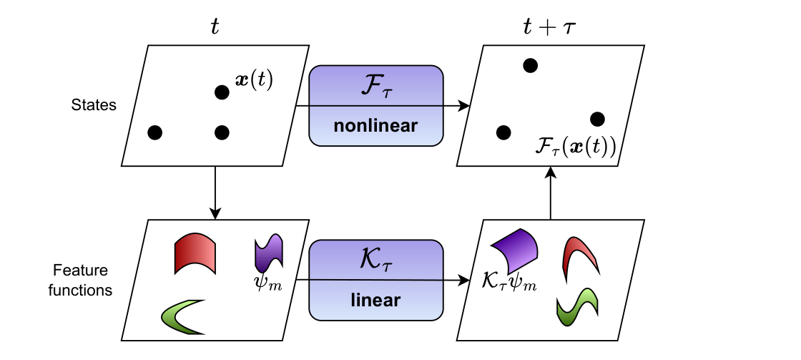

<!-- Course font override -->

# Dynamical Systems Meets Data: 
## DMD, Koopman, and Reduced Representations

### Andrei Gavrilov and Nathan Mankovich

 

---

## Dynamical Systems

A **dynamical system** describes how a state $\mathbf{x}(t)$ evolves over time $t$ according to a fixed rule.

$$
\text{Discrete-time:} \quad \mathbf{x}(t+\tau) = f(\mathbf{x}(t)) \qquad
\text{Continuous-time:} \quad \frac{d\mathbf{x}}{dt} = g(\mathbf{x}(t))
$$

- $\mathbf{x}(t) \in \mathbb{R}^n$: the state at time $t$
- $f, g$: a (possibly nonlinear) update rule
- Goal: Decompose the system into state space and temporal patterns, thus reducing temporal and state space dimensions.

---

## Dynamical Systems (continued)

**Linear Systems**  
If $f(\mathbf{x}) = \mathbf{A}\mathbf{x}$, the system is linear:

$$
\mathbf{x}(t+\tau) = \mathbf{A}\mathbf{x}(t)
$$

$\Rightarrow$ Solutions evolve through powers of $\mathbf{A}$: eigenvalues/eigenvectors govern behavior.

---

## Dynamic Mode Decomposition

Assume that the data is sampled from the timeseries:

$$
\mathbf{x}(t+\tau) \approx \mathbf{A}\,\mathbf{x}(t)
$$

**Decompose the system** into spatial and temporal patterns.

Analyzing $\mathbf{A}$ results in the DMD (\citep{schmid2010dynamic}):

$$
\mathbf{x}(t) = \sum_{j=1}^k \boldsymbol{\phi}_j e^{\omega_j t} b_j
$$

- $\boldsymbol{\phi}_j \in \mathbb{C}^n$ **feature patterns** (dynamic modes)
- $\omega_j \in \mathbb{C}$ **temporal characteristics** (continuous time eigenvalues)
- $b_j \in \mathbb{R}$ scalar loadings (a.k.a. amplitudes)

---

<!-- _class: small -->

## Dynamic Mode Decomposition (math steps)

Starting from

$$
\mathbf{x}(t+\tau) \approx \mathbf{A}\mathbf{x}(t)
$$

iterate in discrete time ($m=t/\tau$):

$$
\mathbf{x}(t) \approx \mathbf{A}^{m}\mathbf{x}(0)
$$

If $\mathbf{A}\mathbf{W}=\mathbf{W}\mathbf{\Lambda}$ and $\mathbf{x}(0)=\mathbf{W}\mathbf{b}$, then

$$
\mathbf{x}(t)
\approx
\mathbf{W}\mathbf{\Lambda}^{m}\mathbf{b}
=
\sum_{j=1}^{k}\boldsymbol{\phi}_j\lambda_j^{t/\tau}b_j
=
\sum_{j=1}^{k}\boldsymbol{\phi}_j e^{\omega_j t} b_j
$$

---

## Eigenvalue Interpretation

$$
\lambda_j = e^{\omega_j \tau}
$$

- Discrete time: $\lambda_j$
- Continuous time: $\omega_j$

Useful conversion:

$$
\omega_j = \frac{1}{\tau}\log(\lambda_j)
$$

---

## Eigenvalue Interpretation (polar form)

Write in polar form:

$$
\lambda_j = r e^{i\theta}
$$

- Trend: $r = |\lambda_j|$
- Oscillation frequency (per $\tau$): $\theta = -i\log(\lambda_j/r)$

and with $\lambda_j = r e^{i\theta}$:

$$
\omega_j = \frac{\log r + i\theta}{\tau}
$$

---

<!-- _class: small -->

## Exact Dynamic Mode Decomposition ([Dawson et al.](https://arxiv.org/pdf/1507.02264))

1. Stack the data

$$
\mathbf{X} = [\mathbf{x}(1)\,|\cdots|\,\mathbf{x}(T-\tau)] \in \mathbb{R}^{n\times p},
\quad
\mathbf{X}' = [\mathbf{x}(1+\tau)\,|\cdots|\,\mathbf{x}(T)] \in \mathbb{R}^{n\times p}
$$

2. Want to solve

$$
\min_{\mathbf{A}} \|\mathbf{X}' - \mathbf{A}\mathbf{X}\|_F
$$

3. Rank-$r$ truncated SVD $\mathbf{X} = \mathbf{U}\mathbf{\Sigma}\mathbf{V}^{\top}$ leads to

$$
\mathbf{A}_\star = \mathbf{X}'\mathbf{X}^{\dagger},
\quad
\mathbf{X}^{\dagger} \approx \mathbf{V}\mathbf{\Sigma}^{-1}\mathbf{U}^{\top}
$$

$$
\tilde{\mathbf{A}} = \mathbf{U}^{\top}\mathbf{X}'\mathbf{V}\mathbf{\Sigma}^{-1} \in \mathbb{R}^{k\times k},
\quad
\tilde{\mathbf{A}}\mathbf{W} = \mathbf{W}\mathbf{\Lambda}
$$

---

<!-- _class: small -->

## Exact Dynamic Mode Decomposition (continued)

4. Dynamic modes

$$
\boldsymbol{\phi}_j = \frac{1}{\lambda_j}\mathbf{X}'\mathbf{V}\mathbf{\Sigma}^{-1}\mathbf{w}_j
$$

5. Eigenvalues (discrete time)

$$
\lambda_j = e^{\omega_j\tau}
$$

6. Loadings found by solving

$$
\boldsymbol{\Phi}\mathbf{b} = \mathbf{x}(1)
$$

Compact reconstruction form:

$$
\mathbf{x}(t) \approx \boldsymbol{\Phi}\,\mathrm{diag}(e^{\omega t})\,\mathbf{b}
$$

---

## My Interpretation (easier?)

The system evolves in the low-dimensional reduced space mapped to by $\mathbf{U}^{\top} \in \mathbb{R}^{k\times n}$:

$$
\mathbf{U}^{\top}\mathbf{x}(t+\tau)
= \mathbf{z}(t+\tau)
= \tilde{\mathbf{A}}\mathbf{z}(t)
= \tilde{\mathbf{A}}\mathbf{U}^{\top}\mathbf{x}(t)
$$

Eigen-decompose $\mathbf{A}$ into eigenvectors $\mathbf{w}_j$ and eigenvalues $\lambda_j$.

Projected dynamic modes:

$$
\boldsymbol{\phi}_j = \mathbf{U}\mathbf{w}_j
$$

DMD analyzes the stability of this system and generates spatial patterns in $\mathbb{R}^n$ (ambient space).

---

<!-- _class: small -->

## Optimized Dynamic Mode Decomposition ([Askham et al.](https://arxiv.org/pdf/1704.02343))

Stack all the data together:

$$
\mathbf{X} = [\mathbf{x}(t_1)\,|\,\mathbf{x}(t_2)\,\cdots|\,\mathbf{x}(t_p)] \in \mathbb{R}^{n\times p}
$$

Optimize directly for DMD matrix decomposition:

$$
\min_{\boldsymbol{\phi}_j,\,\omega_j,\,b_j}
\left\|\mathbf{X} - \sum_{j=1}^r \boldsymbol{\phi}_j e^{\omega_j t} b_j\right\|_F
$$

Translate to:

$$
\min_{\mathbf{A}}\|\mathbf{X}^{\top} - \boldsymbol{\Phi}(\boldsymbol{\alpha})\mathbf{B}\|_F
$$

---

<!-- _class: small -->

## Optimized Dynamic Mode Decomposition (continued)

Equivalent elementwise model:

$$
\mathbf{X}^{\top}_{i,:} \approx \sum_{j=1}^{r} e^{\alpha_j t_i}\,\mathbf{B}_{j,:}
$$

- $\boldsymbol{\Phi}(\boldsymbol{\alpha})_{i,j} = \exp(\alpha_j t_i)$
- $b_j = \|\mathbf{B}^{\top}(:,j)\|_2$
- $\boldsymbol{\phi}_j = \dfrac{\mathbf{B}^{\top}(:,j)}{b_j}$

Solve via variable projection method.

---

## Further Reading

*There are MANY variants of DMD*

- [Multiverse of DMD](https://arxiv.org/pdf/2312.00137)
- [Physics-informed DMD](https://arxiv.org/pdf/2112.04307)
- [Generalizing DMD: Modern Koopman theory](https://arxiv.org/pdf/2102.12086)

---

# Tutorial 
[https://github.com/PyDMD/PyDMD/blob/master/tutorials/tutorial1/tutorial-1-dmd.ipynb](https://github.com/PyDMD/PyDMD/blob/master/tutorials/tutorial1/tutorial-1-dmd.ipynb)

---

# Koopman Mode Decomposition

---

## Koopman Mode Decomposition

**Problem:** there's no linear map that goes from $\mathbf{x}(t)$ to $\mathbf{x}(t+\tau)$...

**Solution:**

---

## Koopman Mode Decomposition

$\psi_m$ “observable” (a.k.a. feature) function

**Koopman operator** (denoted $\mathcal{K}_\tau$) ([Koopman 1931](https://www.pnas.org/doi/pdf/10.1073/pnas.17.5.315)):

$$
\mathcal{K}_{\tau}[\psi_m](\mathbf{x}(t))
=
\psi_m\bigl(\mathcal{F}_{\tau}\mathbf{x}(t)\bigr)
=
\psi_m\bigl(\mathbf{x}(t+\tau)\bigr)
$$

---

<!-- _class: small -->

## Koopman Mode Decomposition (continued 2)

**Koopman mode decomposition** ([Rowley et al. 2009](https://www.cambridge.org/core/journals/journal-of-fluid-mechanics/article/abs/spectral-analysis-of-nonlinear-flows/311041E1027AE7FEE7DDA36AC9AD4270), [Mezić 2013](https://mgroup.me.ucsb.edu/sites/default/files/publications/mezic_-_2013_-_analysis_of_fluid_flows_via_spectral_properties_of_the_koopman_operator.pdf)):

$$
\mathbf{x}(t) = \sum_{j=1}^r \mathbf{b}_j e^{\omega_j t}\,\phi_j(\mathbf{x}(0))
$$

- $\mathbf{b}_j$ **spatial patterns** (dynamic modes)
- $\omega_j$ **temporal characteristics** (continuous time eigenvalues)
- $\phi_j$ Koopman eigenfunctions

---

<!-- _class: small -->

## Koopman Mode Decomposition

---

<!-- _class: small -->

## Koopman Mode Decomposition (continued)

**Koopman operator** (denoted $\mathcal{K}_\tau$) ([Koopman 1931](https://www.pnas.org/doi/pdf/10.1073/pnas.17.5.315)):

$$
\mathcal{K}_{\tau}[\psi_m](\mathbf{x}(t))
=
\psi_m\bigl(\mathcal{F}_{\tau}\mathbf{x}(t)\bigr)
=
\psi_m\bigl(\mathbf{x}(t+\tau)\bigr)
$$

**Koopman mode decomposition** ([Rowley et al. 2009](https://www.cambridge.org/core/journals/journal-of-fluid-mechanics/article/abs/spectral-analysis-of-nonlinear-flows/311041E1027AE7FEE7DDA36AC9AD4270), [Mezić 2013](https://mgroup.me.ucsb.edu/sites/default/files/publications/mezic_-_2013_-_analysis_of_fluid_flows_via_spectral_properties_of_the_koopman_operator.pdf)):

$$
\mathbf{x}(t) = \sum_{j=1}^r \mathbf{b}_j e^{\omega_j t}\,\phi_j(\mathbf{x}(0))
$$

- $\mathbf{b}_j$ **spatial patterns** (dynamic modes)
- $\omega_j$ **temporal characteristics** (continuous time eigenvalues)
- $\phi_j$ **scaling** (Koopman eigenfunctions)

Eigenfunction relation used implicitly:

$$
\mathcal{K}_{\tau}[\phi_j] = e^{\omega_j\tau}\,\phi_j
$$

---

<!-- _class: small -->

## Kernel Koopman Mode Decomposition ([Williams et al. 2015](https://arxiv.org/pdf/1411.2260), [Klus et al. 2017](https://arxiv.org/pdf/1712.01572))

- Embed states into a Reproducing Kernel Hilbert Space (RKHS), denoted $\mathcal{H}$
- Let $\boldsymbol{\psi}:\mathbb{R}^M\to\mathcal{H}$ be the feature map for some kernel $k(\cdot,\cdot)$
- Define the snapshot feature matrices:

$$
\boldsymbol{\Psi}_{\mathbf{X}}
=
\bigl[\boldsymbol{\psi}(\mathbf{x}(1))\,\cdots\,\boldsymbol{\psi}(\mathbf{x}(T-\tau))\bigr]
$$

$$
\boldsymbol{\Psi}_{\mathbf{X}'}
=
\bigl[\boldsymbol{\psi}(\mathbf{x}(\tau+1))\,\cdots\,\boldsymbol{\psi}(\mathbf{x}'(T))\bigr]
$$

---

<!-- _class: small -->

## Kernel Koopman Mode Decomposition (continued)

- Seek finite-dimensional Koopman operator estimate $\tilde{\mathbf{K}}$, found via kernel Gram matrices:

$$
\mathbf{K}_{\mathbf{X}} = \boldsymbol{\Psi}_{\mathbf{X}}^{\top}\boldsymbol{\Psi}_{\mathbf{X}},
\quad
\mathbf{K}_{\mathbf{X}',\mathbf{X}} = \boldsymbol{\Psi}_{\mathbf{X}'}^{\top}\boldsymbol{\Psi}_{\mathbf{X}}
$$

---

<!-- _class: small -->

## Kernel Koopman Mode Decomposition

- Using the eigendecomposition $\mathbf{K}_{\mathbf{X}} = \mathbf{Q}\mathbf{\Sigma}^2\mathbf{Q}^{\top}$
- The finite-dimensional Koopman operator estimate is

$$
\tilde{\mathbf{K}} = \mathbf{\Sigma}^{-1}\mathbf{Q}^{\top}\mathbf{K}_{\mathbf{X}',\mathbf{X}}\mathbf{Q}\mathbf{\Sigma}^{-1}
$$

- Eigenvalue decomposition $\tilde{\mathbf{K}}\mathbf{W} = \mathbf{W}\mathbf{\Lambda}$

---

<!-- _class: small -->

## Kernel Koopman Mode Decomposition (continued)

| Name | Definition |
|:--|:--|
| Eigenfunctions of $\mathbf{X}$ | $\mathbf{\Phi} = \mathbf{K}_{\mathbf{X}}\,\mathbf{Q}\,\mathbf{\Sigma}^{\dagger}\,\mathbf{W}$ |
| Koopman modes | $\mathbf{B} = \mathbf{X}\mathbf{Q}^{\top}\mathbf{\Sigma}^{\dagger}\mathbf{W}^{-1}$ |

---

# Tutorial

- [Extended (Kernel) DMD](https://github.com/PyDMD/PyDMD/blob/master/tutorials/tutorial17/tutorial-17-edmd.ipynb)
- [Koopman Mode Decomposition](https://github.com/dynamicslab/pykoopman)
